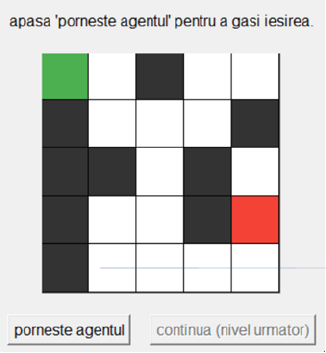
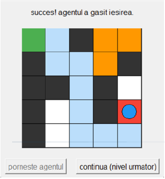

# Rule-Based Maze Solver

A rule-based expert system for solving maze navigation problems using CLIPS, integrated with a Python application and a Tkinter graphical interface.

The application allows the user to select the start and exit positions of a maze and then visualizes the agent as it searches for a valid path. The system uses production rules to guide the agent, avoid obstacles and already visited cells, detect dead ends, and perform backtracking when necessary.

The project was developed as an academic project during my Bachelor's degree in Systems Engineering.

---

## Overview

The main goal of the project was to explore how a rule-based expert system can be used to solve a search problem in a discrete environment.

The maze is represented as a two-dimensional grid containing free cells and walls. The agent starts from a selected position and has to reach the exit while avoiding obstacles and previously visited cells.

The reasoning is handled by a CLIPS inference engine, while the Python application is responsible for the graphical interface, user interaction, and communication with CLIPS.

The system can be used with multiple maze configurations and displays the solving process step by step.

---

## Features

- Rule-based maze solving using CLIPS
- Python integration through `clipspy`
- Interactive Tkinter graphical interface
- Multiple maze levels and configurations
- User selection of start and exit positions
- Automatic obstacle avoidance
- Tracking of visited cells
- Dead-end detection
- Automatic backtracking
- Priority-based rule execution
- Step-by-step visualization of the agent's decisions
- Animated maze-solving process

---

## How It Works

The solving process is based on production rules defined in the CLIPS knowledge base.

At each step, the inference engine evaluates the current state of the agent and determines which rules can be applied.

The general process is:

1. The user selects the start and exit positions.
2. The Python application creates the initial facts describing the maze and the agent.
3. The CLIPS knowledge base is loaded through `clipspy`.
4. The inference engine evaluates the available movement rules.
5. The agent moves to an available and unvisited cell.
6. The system prioritizes directions that bring the agent closer to the exit when possible.
7. Visited cells are tracked to prevent unnecessary cycles.
8. If the agent reaches a dead end, the system switches to backtracking.
9. The previous position is restored and the dead-end cell is marked so that it will not be explored again.
10. The process continues until the exit is reached or no valid path remains.

---

## Rule-Based Reasoning

The system uses several groups of production rules to control the agent's behavior.

### Exit Detection

When the agent reaches the exit position, the current objective is replaced with a success state and the execution stops.

### Dead-End Detection

A dead end is detected when the agent has no valid neighboring cell that can be visited.

In this situation, the system changes its current goal from advancing to backtracking.

### Backtracking

When a dead end is reached, the agent returns to a previously visited cell.

The cell from which the agent is returning is marked as a dead-end path so that the same unsuccessful route is not explored again.

### Priority-Based Movement

The system uses rule priorities to influence the order in which possible movements are considered.

Directions that move the agent closer to the exit are given priority when possible. If these rules cannot be applied, standard movement rules are used according to their predefined priorities.

This allows the system to combine a simple heuristic with backtracking instead of exploring the maze completely blindly.

---

## Search Strategy

The system uses an exploration strategy based on depth-first search with chronological backtracking.

The agent follows one available path until it reaches the exit or encounters a dead end. When a dead end is detected, the system returns to a previous position and continues the exploration using another available direction.

Visited cells and dead-end markers are used to prevent the agent from repeatedly exploring the same unsuccessful paths.

The approach is designed to find a valid path, but it does not guarantee that the resulting path is optimal.

---

## Python and CLIPS Integration

The project uses the `clipspy` library to integrate the CLIPS inference engine into the Python application.

The Python side is responsible for:

- creating the graphical interface
- receiving user input
- representing the maze
- initializing the CLIPS environment
- loading the rule base
- asserting the initial facts
- executing the inference engine step by step
- updating the graphical representation of the maze

The CLIPS side contains the production rules responsible for the agent's decision-making process.

This separation allows the reasoning logic to remain in the knowledge base while the Python application handles the user interface and visualization.

---

## Graphical Interface

The application provides a Tkinter-based graphical interface for interacting with the maze.

The interface includes:

- a grid representation of the maze
- selection of start and exit positions
- visualization of the agent
- visualization of visited cells
- visualization of dead-end paths
- animation of the solving process
- controls for starting the execution and moving to the next maze level

Multiple maze configurations are available, allowing the system to be tested on different layouts.

---

## Project Structure

The project consists of two main components:

```text
Python application
    |
    +-- Graphical interface
    +-- User input
    +-- Maze representation
    +-- CLIPS integration
    +-- Execution and visualization
    |
    v
CLIPS knowledge base
    |
    +-- Movement rules
    +-- Priority rules
    +-- Exit detection
    +-- Dead-end detection
    +-- Backtracking
```

## Technologies

- Python
- CLIPS
- clipspy
- Tkinter
- Rule-based expert systems
- Production rules
- Knowledge representation
- Inference engines

---

## Demo

A video demonstrating the graphical interface and the maze-solving process is included in the repository.

The demo shows the application working with multiple maze configurations and visualizes the agent's movements and decision-making process.

---

## Screenshots

### Graphical Interface

<p align="center">
  
</p>

The application provides an interactive graphical representation of the maze and allows the user to select the start and exit positions.

The project includes multiple maze configurations with different layouts and paths.

### Solving Process & Backtracking

<p align="center">
  
</p>

The agent explores the maze while the interface displays the current state of the search.

When the agent reaches a dead end, the system performs backtracking and continues the search from a previous position.

---

## Getting Started

### Requirements

Python 3.10 or newer and the following Python package are required:

`pip install clipspy`

Tkinter is also required for the graphical interface. It is normally included with standard Python installations.

### Running the Application

Clone the repository:

`git clone https://github.com/USERNAME/rule-based-maze-solver.git`

`cd rule-based-maze-solver`

Install the required dependency:

`pip install clipspy`

Then run the Python application using the `.py` file included in the repository.

The application will open the graphical interface, where you can select the start and exit positions directly on the maze.

The solver can then be started from the interface. The execution is performed step by step, allowing the agent's movement and decision-making process to be visualized.

---

## Limitations

The system was developed as an academic project to demonstrate the use of a rule-based expert system for solving a maze navigation problem.

The implemented approach does not guarantee the shortest possible path. The movement decisions are based on predefined rule priorities and a heuristic that prioritizes directions leading closer to the exit.

The behavior of the system also depends on the order and priorities of the production rules. Since several rules can interact during the inference process, debugging the knowledge base can be more difficult than debugging a conventional procedural implementation.

---

## Future Improvements

Possible improvements include:

- implementing BFS or A* for comparison with the current rule-based approach
- improving the movement heuristics to reduce unnecessary exploration
- reducing the number of backtracking operations
- explicitly highlighting the final solution path
- adding a reset option to the graphical interface
- allowing the user to choose the maze dimensions
- generating maze configurations automatically
- assigning different costs to different movements
- extending the expert system with additional rules and constraints

---

## About

This project gave me hands-on experience with expert systems, knowledge representation, production rules, inference engines, and the integration of CLIPS with Python.

The project also helped me understand how rule priorities and heuristic decision-making can be used to guide an agent through a search space while keeping the decision process explainable.

The combination of CLIPS for the reasoning component and Python/Tkinter for the application and visualization provided practical experience with integrating a knowledge-based system into a graphical application.
